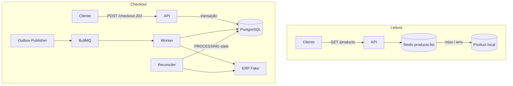

# CaseCellShop Backend

Backend do desafio técnico CaseCellShop: catálogo com cache, checkout assíncrono, controle concorrente de estoque, idempotência, fila/worker, observabilidade e testes.

Um único processo Node sobe a API Fastify, o Outbox Publisher, o Worker BullMQ e o reconciliador. PostgreSQL e Redis rodam ao lado (Compose ou instalação local).

## Funcionalidades

- `GET /products` — catálogo local com cache Redis (`products:list`, TTL) e fallback para PostgreSQL
- `POST /checkout` — `202 Accepted` com `orderId` e `status`; header `Idempotency-Key`
- Prevenção de overselling (`UPDATE` condicional `stock >= quantity` na transação)
- Transactional Outbox (`Order` + `OrderItems` + `OutboxEvent` na mesma transação)
- BullMQ + Worker + ERP Fake (em memória)
- Retry com backoff exponencial, timeout na chamada ao ERP Fake
- `GET /orders/:orderId/status` — `PENDING` | `PROCESSING` | `COMPLETED` | `FAILED`
- Compensação de estoque em falha definitiva (`stockReleasedAt`)
- Reconciliação de pedidos `PROCESSING` antigos
- Logs estruturados (Pino) e métricas Prometheus (`GET /metrics`)
- OpenAPI em `/docs`
- Testes Vitest com PostgreSQL real
- Docker Compose (`api`, `postgres`, `redis`)

## Stack


| Tecnologia              | Uso neste projeto                                                         |
| ----------------------- | ------------------------------------------------------------------------- |
| Node.js 24 + TypeScript | Runtime da imagem Docker e tipagem da API                                 |
| Fastify 5               | HTTP, JSON Schema → OpenAPI, `app.inject()` nos testes                    |
| PostgreSQL              | Persistência, transações, UNIQUE e update condicional de estoque          |
| Prisma 7                | Schema, migrations e client tipado (`@prisma/adapter-pg`)                 |
| Redis                   | Cache do catálogo e backend do BullMQ (mesma instância, papéis distintos) |
| BullMQ                  | Fila `order-processing` e worker no mesmo processo da API                 |
| prom-client             | Registry Prometheus em `GET /metrics`                                     |
| Vitest                  | Suíte em `pnpm test`                                                      |
| Docker Compose          | Subida reproduzível para avaliação                                        |


## Arquitetura

Detalhes em `[docs/ARCHITECTURE.md](docs/ARCHITECTURE.md)`.




**Leitura:** cache-aside. Hit no Redis; miss ou falha do Redis lê `Product` no PostgreSQL.

**Checkout:** a request HTTP **não** chama o ERP. Persiste o comando, responde `202`, e o processamento segue no background.

```
POST /checkout
→ transação: Order + OrderItems + OutboxEvent + decremento de estoque
→ 202 { orderId, status }

Outbox Publisher → BullMQ → Worker → ERP Fake
→ COMPLETED ou FAILED

Reconciler: PROCESSING com updatedAt antigo → consulta ERP Fake
```

Observabilidade (logs + métricas) cobre API, cache, outbox, worker, ERP Fake e reconciliação. Ver `[docs/OBSERVABILITY.md](docs/OBSERVABILITY.md)`.

### Product no desafio

No desenho conceitual, `Product` é o read model local da loja.

No código, os produtos entram pelo **seed** (`prisma/seed.ts`). **Não há sincronização com um MySQL de ERP.** `externalId` existe para identificar o item da vitrine; o ERP Fake só simula `processOrder` / `getOrderStatus` em memória.

O estoque da vitrine não é garantia de venda. A garantia está no `UPDATE` condicional do checkout.

## Consistência e concorrência

Na transação do checkout:

1. valida produtos e calcula totais com preço do banco (`Decimal`);
2. cria `Order` + itens + `OutboxEvent` (`idempotencyKey` UNIQUE);
3. decrementa estoque com `updateMany` onde `stock >= quantity`.

Se o estoque não alcançar, a transação faz rollback (pedido e outbox não ficam gravados). Duas compras na última unidade: uma `202`, outra `409 INSUFFICIENT_STOCK`.

Não há distributed lock nem `SELECT FOR UPDATE`. A serialização do estoque fica no PostgreSQL, no recorte de uma instância de escrita neste desafio.

**Idempotência:** header `Idempotency-Key`. Fingerprint SHA-256 dos itens normalizados (`requestFingerprint`). Mesma chave + mesmo payload devolve o pedido existente (`202`). Mesma chave + payload diferente: `409 IDEMPOTENCY_KEY_REUSED`.

## Transactional Outbox

`Order`, itens e `OutboxEvent` saem no mesmo `COMMIT`. O ERP e a fila não entram nessa transação.

O publisher (polling, default 1s) lê eventos `PENDING`, publica na fila com `jobId = outboxEvent.id` e só então marca `PUBLISHED`. Falha na fila deixa o evento `PENDING` e incrementa `attempts`.

O processamento é **at-least-once**, não exactly-once. A mensagem pode ser entregue de novo. O efeito de negócio é protegido por:

- `jobId` determinístico no BullMQ;
- worker que ignora `COMPLETED` / `FAILED`;
- ERP Fake que não reprocessa o mesmo `orderId` **enquanto o processo estiver no ar**.

## Checkout assíncrono

```http
POST /checkout
Idempotency-Key: <chave>
Content-Type: application/json

{ "items": [{ "productId": "<uuid>", "quantity": 1 }] }
```

Resposta `202`:

```json
{ "orderId": "<uuid>", "status": "PENDING" }
```

Replay da mesma chave pode devolver um status já avançado (`PROCESSING`, `COMPLETED`, `FAILED`).


| Status       | Significado                                     |
| ------------ | ----------------------------------------------- |
| `PENDING`    | Aceito, ainda não pego pelo worker              |
| `PROCESSING` | Worker em andamento (ou retry)                  |
| `COMPLETED`  | ERP Fake aceitou; estoque permanece consumido   |
| `FAILED`     | Tentativas esgotadas; estoque devolvido uma vez |


Consulta: `GET /orders/:orderId/status`.

## Retry, timeout e compensação

- Timeout da chamada ao ERP Fake: `ERP_TIMEOUT_MS` (default 1000)
- Tentativas do job: `ORDER_JOB_ATTEMPTS` (default 3)
- Backoff exponencial: `ORDER_JOB_BACKOFF_MS` (default 200)
- `FAILED` só depois da última tentativa
- Compensação incrementa o estoque dos itens e grava `stockReleasedAt`; uma segunda chamada não devolve de novo

## Reconciliação

Um loop no mesmo processo (`ORDER_RECONCILIATION_INTERVAL_MS`, default 5s) busca `PROCESSING` com `updatedAt` anterior a `ORDER_RECONCILIATION_STALE_MS` (default 15s) e pergunta `getOrderStatus` ao ERP Fake.

- ERP `COMPLETED` → Order `COMPLETED` (estoque segue consumido)
- ERP `NOT_FOUND` → Order volta a `PENDING` e, se preciso, um novo `OutboxEvent` PENDING (o publisher/worker reprocessam)

Não há endpoint HTTP de reconciliação. Uma instância só; várias instâncias exigiriam claim/lock, não implementado.

O ERP Fake guarda pedidos processados num `Set` em memória. **Restart da API zera esse Set.** Pedidos `PROCESSING` persistidos no Postgres podem ser tratados como `NOT_FOUND` e reenfileirados.

## Cache

- Estratégia cache-aside, chave `products:list`
- TTL `PRODUCTS_CACHE_TTL_SECONDS` (default 30)
- Redis indisponível: log `products_cache_error`, leitura no PostgreSQL, `GET /products` continua 200
- Invalidação (`DEL`) depois de checkout aceito e depois de compensação de estoque
- Single-flight (`inflightListProducts`) evita stampede **no mesmo processo Node**; não é lock distribuído

Há dois clientes Redis: `redis` (cache) e `ioredis` (BullMQ, `maxRetriesPerRequest: null`).

## Observabilidade

Logs JSON (Pino/Fastify) com `event`, `requestId`, `correlationId` (header `x-correlation-id` ou UUID gerado) e `orderId` quando existe. Identificadores não vão para labels de métrica.


| Tipo      | Exemplos                                                                               |
| --------- | -------------------------------------------------------------------------------------- |
| Counter   | cache hits/misses, checkout, outbox, worker, ERP, reconciliação                        |
| Gauge     | fila waiting, orders PENDING/PROCESSING, stale PROCESSING (consulta o banco no scrape) |
| Histogram | duração HTTP, ERP e worker                                                             |


`GET /metrics` — texto Prometheus. Sem servidor Prometheus, Grafana ou Datadog neste repositório. `/metrics` não entra no Swagger (`hide: true`).

Painéis e alertas conceituais: `[docs/OBSERVABILITY.md](docs/OBSERVABILITY.md)`.

## OpenAPI

UI: [http://localhost:3000/docs](http://localhost:3000/docs)

Os JSON Schemas das rotas Fastify geram o contrato:

- `GET /health`
- `GET /products`
- `POST /checkout`
- `GET /orders/:orderId/status`

## Como rodar (Docker)

Caminho recomendado para avaliação. Requer Docker Compose.

```sh
git clone https://github.com/iagoluancj/casecellshop-backend-challenge.git
cd casecellshop-backend-challenge
docker compose up --build
```


| URL                                                              | Função                                          |
| ---------------------------------------------------------------- | ----------------------------------------------- |
| [http://localhost:3000/health](http://localhost:3000/health)     | liveness da API                                 |
| [http://localhost:3000/docs](http://localhost:3000/docs)         | Swagger UI                                      |
| [http://localhost:3000/metrics](http://localhost:3000/metrics)   | Prometheus                                      |
| [http://localhost:3000/products](http://localhost:3000/products) | catálogo (seed)                                 |
| [http://localhost:3000](http://localhost:3000)                   | `POST /checkout`, `GET /orders/:orderId/status` |


Publisher, Worker e Reconciler sobem no container `api` (mesmo `node dist/server.js`). Postgres e Redis **não** são publicados no host.

O entrypoint aplica `prisma migrate deploy`, roda o seed (não cria Orders; não reseta estoque já existente) e inicia o servidor.

```sh
docker compose down      # para containers; volumes permanecem
docker compose down -v   # também apaga Postgres e Redis AOF — ambiente limpo
```

Mais detalhe: `[docs/DOCKER.md](docs/DOCKER.md)`.

## Como rodar sem Docker

PostgreSQL e Redis locais. Node compatível com a imagem do projeto (24) e pnpm 11.

```sh
pnpm install
cp .env.example .env   # preencher USER/PASSWORD e os nomes dos bancos
```

Crie os bancos `casecellshop_dev` e `casecellshop_test`. Ajuste `DATABASE_URL` e `DATABASE_URL_TEST` em `.env`.

```sh
pnpm db:migrate        # prisma migrate dev — desenvolvimento
pnpm db:seed
pnpm dev               # tsx watch src/server.ts — porta 3000
```

Build de produção local: `pnpm build` e `pnpm start` (`node dist/server.js`).

## Testes

```sh
pnpm test
```

Não roda no `docker compose up`. Usa **somente** `DATABASE_URL_TEST` apontando para o banco chamado `casecellshop_test` (`test/setup.ts` recusa outro nome) e aplica `prisma migrate deploy`. Redis é necessário nos testes de fila.

A suíte bate no PostgreSQL de verdade (concorrência incluída, não só mock):

- checkout aceito, estoque insuficiente, rollback multi-item
- overselling (duas compras na última unidade)
- idempotência sequencial, mesma chave concorrente, payload diferente, estoque just-enough
- outbox (`jobId`, persistência em `PENDING` se a fila falhar)
- worker, retry, `FAILED`, compensação única
- `GET /orders/:orderId/status`
- cache HIT/MISS e counters de checkout/ERP
- reconciliação (stale vs recente, COMPLETED / NOT_FOUND)

Arquivos em `test/`. `fileParallelism` está desligado no Vitest.

## Variáveis de ambiente

Definidas em `.env.example`. O Compose injeta as da API sem usar `.env` do host (URLs internas `postgres` / `redis`).


| Variável                           | Função                                                          | Default no código            |
| ---------------------------------- | --------------------------------------------------------------- | ---------------------------- |
| `PORT`                             | Porta HTTP                                                      | `3000`                       |
| `DATABASE_URL`                     | PostgreSQL da aplicação                                         | obrigatória (sem default)    |
| `DATABASE_URL_TEST`                | PostgreSQL da suíte; database name deve ser `casecellshop_test` | obrigatória para `pnpm test` |
| `REDIS_URL`                        | Cache e BullMQ                                                  | `redis://localhost:6379`     |
| `PRODUCTS_CACHE_TTL_SECONDS`       | TTL de `products:list`                                          | `30`                         |
| `OUTBOX_POLL_INTERVAL_MS`          | Intervalo do publisher                                          | `1000`                       |
| `ERP_TIMEOUT_MS`                   | Timeout da chamada ao ERP Fake                                  | `1000`                       |
| `ORDER_JOB_ATTEMPTS`               | Tentativas BullMQ                                               | `3`                          |
| `ORDER_JOB_BACKOFF_MS`             | Delay base do backoff exponencial                               | `200`                        |
| `ERP_FAKE_MODE`                    | `success`, `fail_always` ou `timeout`                           | `success`                    |
| `ORDER_RECONCILIATION_STALE_MS`    | Idade mínima de `PROCESSING` para reconciliar                   | `15000`                      |
| `ORDER_RECONCILIATION_INTERVAL_MS` | Intervalo do reconciliador                                      | `5000`                       |


No Compose, Postgres usa usuário/senha/db `casecellshop` (apenas local).

## Decisões e trade-offs

**PostgreSQL para overselling.** O `UPDATE` condicional na transação do checkout evita distributed lock neste recorte.

**Redis real, não Map em memória.** O cache pode ser compartilhado e o BullMQ reutiliza a mesma instância.

**BullMQ em vez de RabbitMQ/Kafka.** Já havia Redis; a fila cabe no mesmo processo da API.

**Transactional Outbox.** Corta o dual write. Não torna a chamada ao ERP atômica.

**At-least-once + idempotência.** Preferível a declarar exactly-once sem base.

**ERP Fake em memória.** Serve para retry, timeout e reconciliação no desafio. 

**Read model via seed.** Sync com MySQL legado ficou fora do recorte executável.

**Logs + métricas +** `correlationId`**.** Sem OpenTelemetry.

**Publisher, worker e reconciliador no mesmo processo.** Um container `api`. Várias réplicas da API não estão resolvidas (dois publishers, dois reconcilers).

## Com mais tempo

- Adaptador de ERP de verdade e persistência do status remoto
- Job de sync do catálogo
- CI (`pnpm test` + `docker compose`)

## Uso de IA

Ferramentas de IA apoiaram implementação e revisão. Decisões e comportamento estão no código e na suíte. Prompts relevantes: `[PROMPTS.md](PROMPTS.md)`.