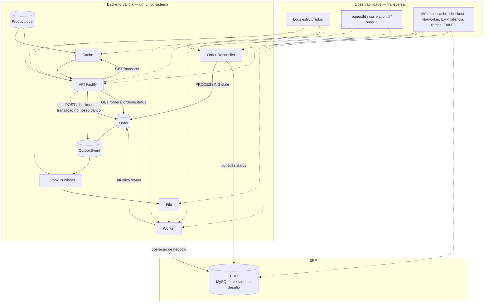
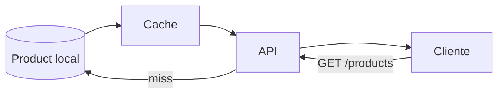
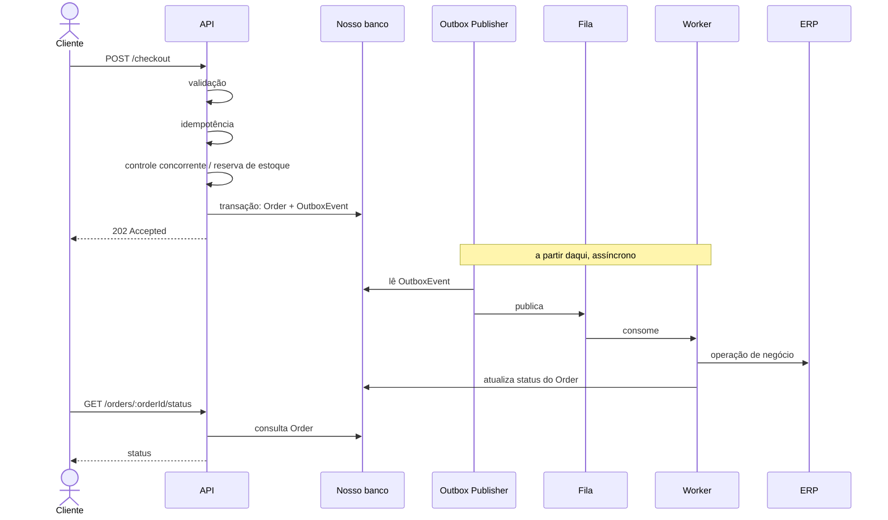

# Arquitetura — CaseCellShop Backend

## Visão geral

O ERP legado permanece responsável por estoque, faturamento e demais rotinas da empresa, e não é alterado. O backend da loja reduz o acoplamento síncrono com esse sistema: a API não espera o ERP para aceitar um pedido.

Catálogo e checkout têm caminhos distintos. O catálogo lê uma projeção local (Read Model) atrás de cache. O checkout persiste o comando no banco da aplicação e encaminha a operação com o ERP para processamento assíncrono.

## Arquitetura geral



## Catálogo

`GET /products` consulta o cache primeiro. Em miss, a API lê a tabela local `Product` — um read model **simulado**. Neste desafio não há sincronização automática com um MySQL de ERP: o catálogo entra pelo seed. O estoque da vitrine não é garantia para o checkout.



## Checkout assíncrono

```
POST /checkout
→ validação
→ idempotência
→ controle concorrente de estoque
→ transação Order + OutboxEvent
→ 202 Accepted
→ fila
→ worker
→ ERP
→ atualização do status
```

`Order` e `OutboxEvent` são gravados na mesma transação no banco da aplicação. O ERP não participa dessa transação. Depois do `202 Accepted`, o Outbox Publisher publica o evento, o worker consome a fila, chama a integração com o ERP e atualiza o pedido.

Status do pedido: `PENDING`, `PROCESSING`, `COMPLETED`, `FAILED`.

O status é consultado em `GET /orders/:orderId/status`.

O Order Reconciler (polling interno, uma instância, ciclo de vida em `server.ts`) detecta `PROCESSING` com `updatedAt` acima de `ORDER_RECONCILIATION_STALE_MS` e consulta o ERP Fake. Não há endpoint HTTP. Várias instâncias exigiriam claim/lock/leader election — fora do escopo.



## Observabilidade

Instrumentação atual: `docs/OBSERVABILITY.md`.

- logs estruturados
- `requestId` / `correlationId`
- métricas de cache
- métricas de checkout
- fila e worker
- latência e falhas da integração com o ERP
- `GET /metrics` (Prometheus)
- reconciliação de `PROCESSING` stale

## Decisões técnicas

- cache Redis cache-aside; fallback para PostgreSQL se o Redis falhar
- fila BullMQ no Redis (mesma instância do cache, responsabilidades distintas)
- estoque com `UPDATE ... WHERE stock >= quantity` na transação do checkout
- `Product` local/seed; sem sync com ERP MySQL
- sem tracing/OpenTelemetry neste recorte
- Docker Compose para avaliação: um processo `api` + `postgres` + `redis` (`docs/DOCKER.md`)
